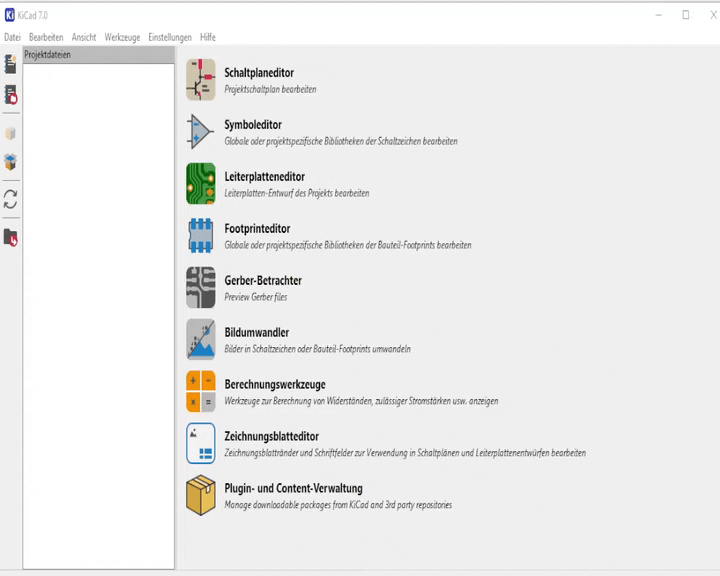

# easyeda_footprint_wizard_kicad

A footprint wizard implementation of the easyeda2kicad-project. Aims to suport 3d model import and footprint generation from a LCSC part number without the "hassle" of calling a CLI tool.

This plugin should work with kicad 10, 9, 8, 7 and kicad 6.

# Usage

After installation, a new "EasyEDA" wizard should be in the list of footprint wizards. Give it an LCSC number and watch it go :)



# Installation

This package can be installed using the Kicad Content Manager. To do this, download the `package.zip` from the releases tab. Then start the Kicad Plugin Manager, choose `Install from File` and select the downloaded zip file. If all goes well, then the wizard should show up in the Footprint editor now. 

# Manual Installation

This wizard needs easyeda2kicad and its dependency expandvars installed as python libs. They can be installed using pip as described below.

> **Important:** KiCad ships with its own embedded Python interpreter. Packages installed with a system-wide `pip` (or via a separate Python installation) are **not** visible to KiCad. The dependencies must be installed into KiCad's own Python environment using the method below, otherwise the plugin will fail to load with `ModuleNotFoundError: No module named 'expandvars'` or `No module named 'easyeda2kicad'`.

You can install easyeda2kicad (which will pull in expandvars automatically) using pip

```
pip install easyeda2kicad
```

After installation, download this source folder and paste it inside one of the /plugins paths kicad searches. The paths can be found by looking inside the `footprint editor -> New Footprint From Wizard -> Messages` dialog. 

On Windows, one such path would be `%APPDATA%\kicad\[version]\plugins`. Make sure the __init__.py and the easyEdaWizard.py have been pasted inside a new folder in this directory. 

## Windows 

The Kicad python installation actually ships with pip, so to install easyeda2kicad on windows, use the pip module inside the python scripting ui. Type

```
import pip
pip.main(["install", "easyeda2kicad"])
```

This installs easyeda2kicad together with its dependency expandvars into KiCad's embedded Python, in the right path. It can fail due to insufficient permissions, in this case installing the plugin using the Content Manager is preferred. 


